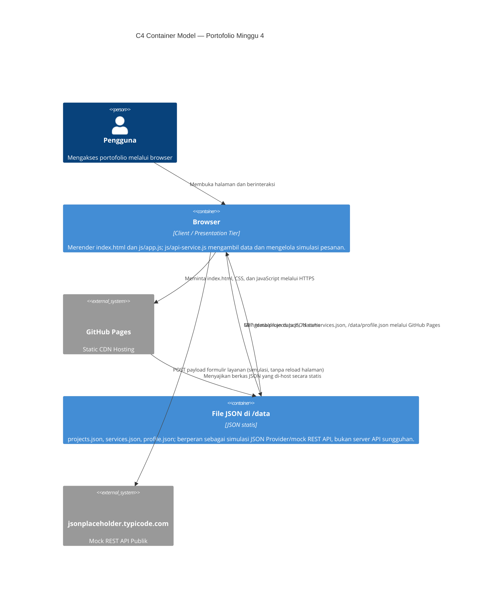
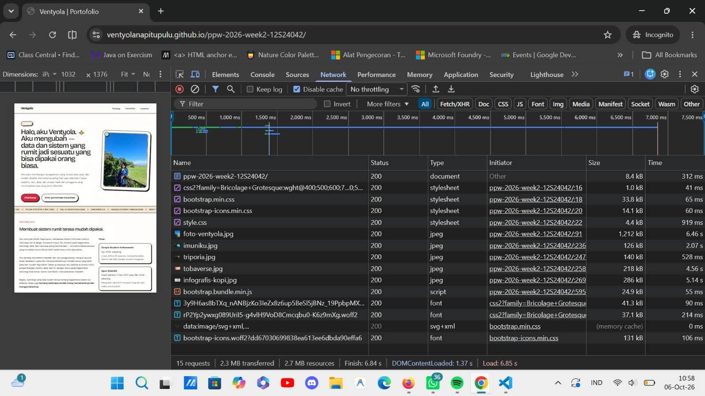
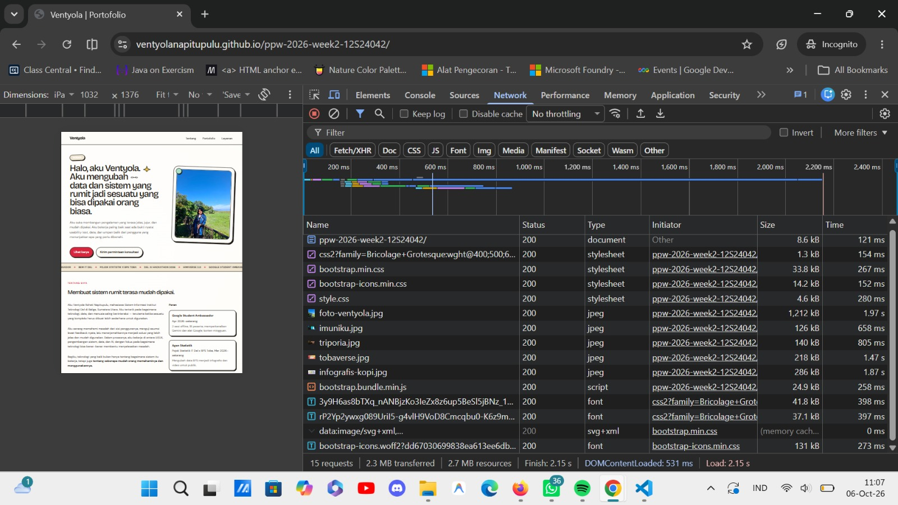
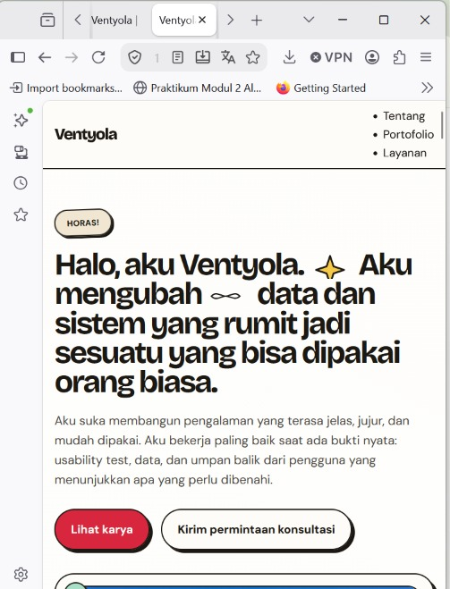
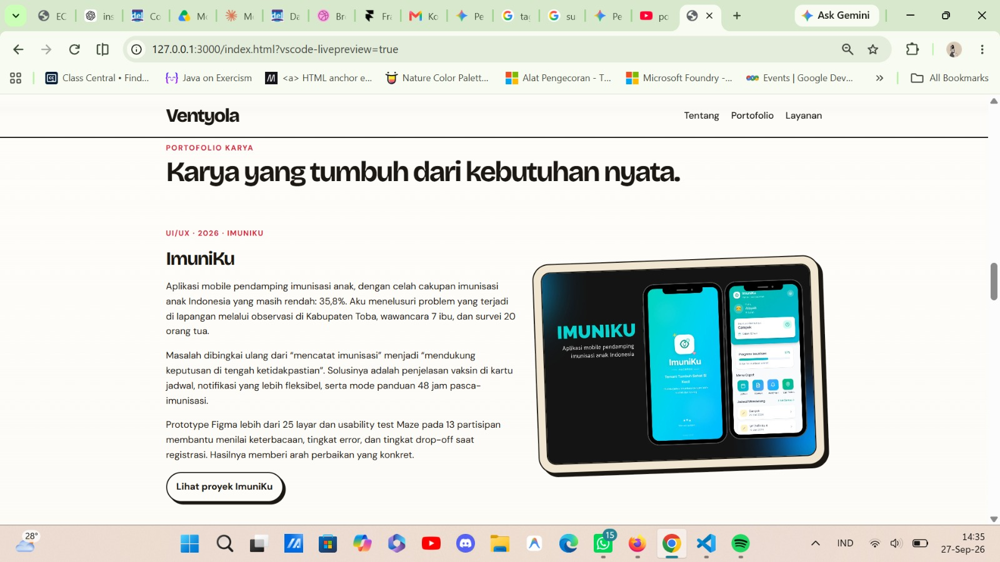
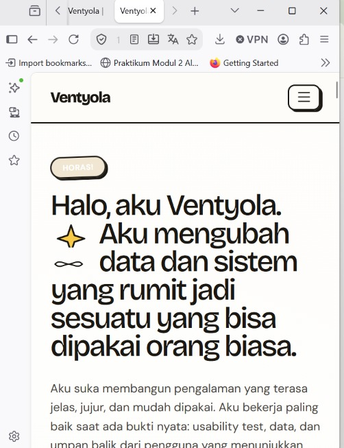
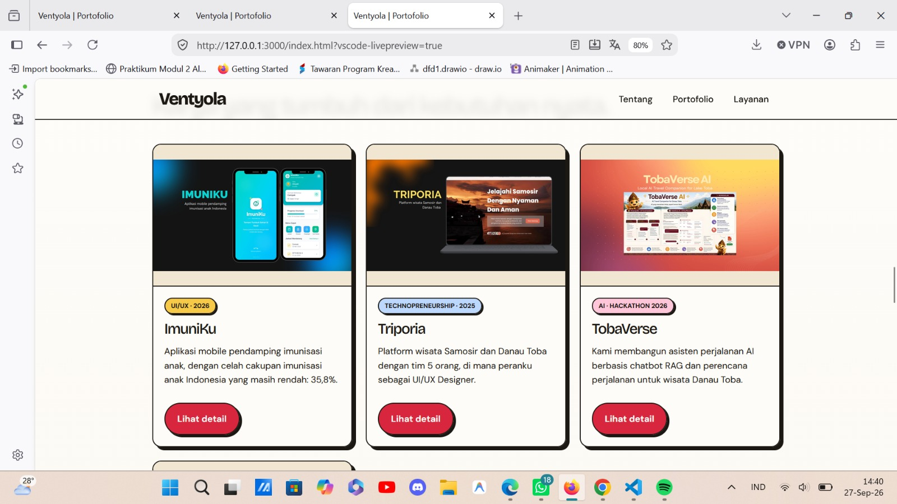

# Portofolio Ventyola Rohati Napitupulu

**Nama:** Ventyola Rohati Napitupulu
**NIM:** 12S24042
**Kelas:** 13SI2
**Mata Kuliah:** Pemrograman dan Pengujian Aplikasi Web (12S3101)

## Deskripsi

Website portofolio single page untuk Ventyola Rohati Napitupulu, mahasiswa Sistem Informasi Institut Teknologi Del. Situs ini menampilkan profil personal, pengalaman organisasi dan praktik, studi kasus karya, serta formulir layanan dengan konsep visual yang playful dan personal (tema "paper & sticker").

Pada Minggu 3, proyek ini direfaktor dari HTML5 + CSS murni (Minggu 2) menjadi berbasis Bootstrap 5.3, dipadukan dengan Custom CSS Overrides — tanpa menghilangkan identitas visual yang sudah dibangun sebelumnya.

Pada Minggu 4, proyek ini ditransformasikan dari arsitektur monolitik statis (data tertanam di HTML) menjadi arsitektur decoupled multi-tier dengan Dynamic Client-Side Rendering (CSR): seluruh konten dimuat secara asinkron dari sumber data JSON modular, memakai satu komponen modal universal, dan formulir layanan dikirim secara asinkron tanpa reload halaman.

## Daftar Fitur

- Layout single page dengan navigasi anchor ke section utama
- Navbar responsif dengan tombol hamburger (Bootstrap collapse) untuk layar ponsel
- Hero dengan badge, headline khas, dan elemen dekoratif SVG
- Section Tentang Saya: bio, peran, keahlian, alur kerja, dan prestasi — dimuat dinamis dari `profile.json`
- Section Portofolio Karya: data kartu dimuat dari `projects.json`, disaring di sisi klien, dan ditampilkan dalam satu modal universal
- Katalog layanan (`services.json`) dimuat dinamis ke dropdown formulir, lengkap dengan detail fitur dan tarif per layanan
- Formulir layanan Bootstrap: Floating Labels, validasi visual, pengiriman asinkron (fetch POST), toast, dan riwayat pesanan di `localStorage`
- Empat UI States dikelola untuk data proyek dan profil: Loading (skeleton), Success, Empty, dan Error dengan tombol "Coba lagi"
- Tabel rekap karya dan pengalaman
- Sticky note kontak cepat di samping formulir
- Content Security Policy (CSP) sebagai lapis pertama pertahanan terhadap DOM-based XSS

## Teknologi

- HTML5 semantik
- CSS3 (24 custom properties di `:root`, dimuat setelah Bootstrap agar override konsisten tanpa `!important`)
- Bootstrap 5.3.8 (CDN) + Bootstrap Icons 1.11.3
- JavaScript bawaan Bootstrap (collapse, modal) + skrip validasi form standar Bootstrap
- JavaScript ES6+ (async/await, Fetch API) — Data Access Layer (`js/api-service.js`) dan Presentation Layer (`js/app.js`)
- JSON statis (`data/`) sebagai decoupled mock data provider; tidak ada backend atau database sungguhan
- Google Fonts: Bricolage Grotesque, DM Sans, Caveat

## Arsitektur Minggu 4

### C4 Container Model



Diagram ini menggambarkan hosting statis, bukan layanan backend: browser mengambil file JSON yang di-host sebagai aset melalui GitHub Pages. Pengiriman formulir layanan disimulasikan lewat `fetch POST` ke layanan mock publik (`jsonplaceholder.typicode.com`), yang membalas sukses tanpa benar-benar menyimpan data; riwayat pesanan yang terlihat di UI tetap disimpan di `localStorage` browser, bukan di database.

### Separation of Concerns

Pada Minggu 4, data proyek, layanan, dan profil ditempatkan terpisah dalam file JSON di `data/`. File-file ini menjadi sumber data statis yang dapat dibaca browser, bukan database dan bukan API backend sungguhan. Pemisahan ini membuat pembaruan konten lebih terarah: isi data dapat diubah tanpa mencari dan mengedit markup kartu atau modal satu per satu.

Logika akses data dipusatkan di `js/api-service.js`, sedangkan `js/app.js` menangani presentasi dan interaksi seperti loading state, filter, render kartu, modal universal, dan pengiriman pesanan asinkron. `index.html` menyediakan struktur halaman dan elemen dasar UI. Dibanding Minggu 3 yang menanam data proyek dan detailnya langsung di HTML, susunan ini mengurangi duplikasi, memudahkan pemeliharaan, dan memisahkan tanggung jawab tiap lapisan tanpa mengklaim adanya backend.

Keamanan sisi klien diterapkan berlapis: setiap data dinamis yang disisipkan ke DOM melewati fungsi `escapeHTML()` untuk mencegah DOM-based XSS, tautan eksternal divalidasi protokolnya (`http`/`https` saja) sebelum dipasang ke atribut `href`, dan Content Security Policy pada `<meta>` tag membatasi sumber skrip, gaya, font, dan koneksi jaringan yang diizinkan dimuat oleh halaman.

### Hasil Profiling DevTools
| Metrik | Cold Load | Warm Load |
|---|---|---|
| Time to First Byte (TTFB) | 310.26 ms | (Memory Cache / ~0 ms) |
| Jumlah Request | 15 requests | 15 requests |
| Total Transfer Size | 2.3 MB transferred | ~0 B (diambil dari cache) |
| Status Cache (ada 304 atau tidak) | Tidak ada (status 200 OK) | Ada (di-serve dari `memory cache` / `disk cache`) |
**Screenshot Waterfall:**




### Sebelum vs Sesudah Refactoring (Minggu 3 → Minggu 4)

| Aspek | Sebelum (Minggu 3) | Sesudah (Minggu 4) |
|---|---|---|
| Sumber data | Data proyek ditulis statis (hardcoded) langsung sebagai markup kartu di `index.html` | Data dipindah ke `data/projects.json`, `services.json`, `profile.json`; dimuat lewat `fetch()` dengan `async/await` |
| Cara render kartu | Kartu dan konten ditulis manual satu per satu di HTML | Dirender dinamis oleh `app.js` dari data JSON (template string + `innerHTML` yang di-escape lewat `escapeHTML()`) |
| Jumlah elemen modal | 4 modal terpisah, satu per proyek (duplikasi markup) | 1 modal universal (`#universalProjectModal`), isi diinjeksi dinamis berdasarkan `data-project-id` |
| Cara submit form | Form `method="get" action="#"`, submit tanpa penanganan asinkron eksplisit | `fetch POST` asinkron ke endpoint mock, `preventDefault()` mencegah reload, umpan balik via Toast |
| Penyimpanan riwayat pesanan | Tidak ada — data hilang begitu form dikirim/direset | Disimpan ke `localStorage` (key `serviceOrders`), ditampilkan sebagai badge jumlah pesanan yang reaktif |

> **Catatan:** Baris "Jumlah elemen modal" dan "Cara submit form" disusun berdasarkan rencana refactor Minggu 4; verifikasi kembali terhadap kode aktual di branch `week3-bootstrap` sebelum dikumpulkan, untuk memastikan deskripsi "Sebelum" benar-benar mencerminkan kondisi branch tersebut.

## Sebelum vs Sesudah Integrasi Framework (Minggu 2 → Minggu 3)

| Aspek | Sebelum (Minggu 2) | Sesudah (Minggu 3) |
|---|---|---|
| Navigasi | Daftar link statis di header, tanpa menu mobile | Navbar Bootstrap (`navbar-expand-lg`) dengan tombol hamburger yang collapse rapi di layar ponsel |
| Layout portofolio | 4 studi kasus tersusun manual berselang-seling memakai CSS Grid kustom | Grid kartu Bootstrap 12-kolom (`row-cols-1 row-cols-md-2 row-cols-lg-3 g-4`) yang otomatis menyesuaikan jumlah kolom per breakpoint |
| Detail proyek | Teks studi kasus lengkap langsung tampil di halaman, membuat halaman panjang | Ringkasan singkat di kartu; detail lengkap dipindah ke Bootstrap Modal (4 modal, isi berbeda per proyek) |
| Formulir | Input/select/textarea polos dengan label statis di atas field | Floating Labels (`.form-floating`), Input Group berikon pada email & telepon, serta `invalid-feedback`/`valid-feedback` per field |
| CSS kustom | Variabel `:root` dan gaya ditulis manual penuh untuk semua elemen | Variabel `:root` dipertahankan (24 variabel), ditambah override komponen Bootstrap (navbar, card, modal, form) agar tetap memakai identitas visual sendiri |
| Aturan `!important` | Tidak relevan (belum pakai Bootstrap) | Nol penggunaan `!important` di luar satu pengecualian terdokumentasi: `@media (prefers-reduced-motion: reduce)` untuk aksesibilitas |

### Kenapa perubahan ini dilakukan, bukan cuma "ganti tampilan"

**Navbar & responsivitas.** Di Minggu 2, semua link navigasi ditampilkan sejajar tanpa mempertimbangkan layar kecil — di HP, ini berisiko bertumpuk atau memaksa halaman melebar (overflow horizontal). Navbar Bootstrap menyelesaikan ini dengan pola *mobile-first*: link disembunyikan di balik tombol hamburger pada layar sempit, dan otomatis tampil sejajar di layar besar, tanpa satu baris kode JavaScript pun ditulis manual — semua dikendalikan lewat atribut `data-bs-toggle="collapse"` dan `data-bs-target`.

**Grid & Modal, bukan cuma estetika.** Menyimpan 4 studi kasus panjang langsung di halaman utama membuat pengguna harus scroll jauh sebelum sampai ke formulir kontak. Dengan memindahkan detail ke Modal, halaman utama jadi ringkas (pengguna cukup memindai kartu), sementara informasi lengkap tetap tersedia satu klik, tanpa reload halaman. Grid `row-cols-*` juga menyelesaikan masalah proporsi: pada Minggu 2, tata letak 4 kartu ditentukan manual per breakpoint; di Bootstrap, jumlah kolom otomatis menyesuaikan (1 kolom di HP, 2 di tablet, 3 di layar besar) tanpa perlu menulis ulang CSS Grid setiap kali.

**Formulir & validasi visual.** Form Minggu 2 memvalidasi input hanya lewat atribut HTML bawaan (`required`, `pattern`), tapi tidak memberi umpan balik visual yang jelas saat pengguna salah isi. Floating Labels membuat form terasa lebih modern dan menghemat ruang (label berfungsi ganda sebagai placeholder), sementara `invalid-feedback`/`valid-feedback` memberi konfirmasi visual instan — pengguna tidak perlu menebak apakah input mereka sudah benar.

**Kenapa custom CSS dipertahankan, bukan dihapus.** Alasan utama memakai Bootstrap bukan untuk mengganti identitas visual, tapi untuk mendapatkan *komponen* (navbar collapse, modal, form validation) yang sudah teruji dan accessible tanpa membangun dari nol. Semua warna, bentuk, dan micro-interaction (shadow kotak, border tebal, rotasi kecil pada elemen) yang menjadi identitas personal tetap dipertahankan lewat `custom-style.css` yang dimuat **setelah** Bootstrap CSS — sehingga override menang lewat urutan cascade, tanpa perlu memaksa lewat `!important`.

**Tampilan Sebelum (Minggu 2):**




**Tampilan Sesudah (Minggu 3, sudah Bootstrap 5):**




## Cara Menjalankan

1. Buka folder proyek ini di VS Code.
2. Jalankan ekstensi **Live Server** pada `index.html`, atau buka file tersebut langsung di browser.
   - Membuka `index.html` langsung lewat `file://` (klik dua kali) **tidak akan memuat data JSON**, karena `fetch()` ke file lokal diblokir kebijakan CORS browser. Wajib pakai Live Server atau server lokal lain.
3. Tidak ada instalasi tambahan — Bootstrap dan Bootstrap Icons dimuat lewat CDN, jadi memerlukan koneksi internet saat pertama kali membuka halaman.

## Branch

`week4-architecture` — refactor arsitektural Minggu 4, melanjutkan repositori Minggu 3 (`week3-bootstrap`).

## Live Demo (GitHub Pages)
https://ventyolanapitupulu.github.io/ppw-2026-week2-12S24042

## Struktur Folder

```text
.
├── index.html
├── README.md
├── css/
│   └── custom-style.css
├── data/
│   ├── projects.json
│   ├── services.json
│   └── profile.json
├── js/
│   ├── api-service.js
│   └── app.js
└── assets/
    └── img/
        ├── foto-ventyola.jpeg
        ├── imuniku.jpeg
        ├── triporia.jpeg
        ├── tobaverse.jpeg
        ├── infografis-kopi.jpeg
        ├── screenshot-sebelum1.jpeg
        ├── screenshot-sebelum2.jpeg
        ├── screenshot-sesudah1.jpeg
        ├── screenshot-sesudah2.jpeg
        ├── devtools-cold-load.jpeg
        └── devtools-warm-load.jpeg
```